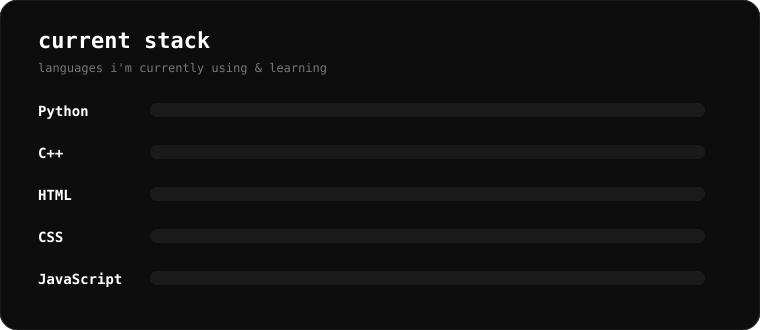

<h1 align="center">Hey, I'm icalx 👋</h1>

  16 y/o developer from Saudi Arabia 🇸🇦 
  Building tools, automation & software

  
  
  

  

About Me

I'm a developer who likes building things that are actually useful.

🐍 Python

⚡ C++

🌐 HTML / CSS

🟨 JavaScript

🛠️ Tools, automation & software

📚 Currently focused on C++ and problem solving

Languages

  

  The bars are a visual showcase of my current stack, not measured skill percentages.

  

Tech Stack

  

GitHub Stats

  
  

Projects

More projects coming soon.

Synthex

Tools, automation and software built under the Synthex name.

<!-- Add your project cards here later -->

Currently

Learning C++
Improving problem-solving
Building better tools
Learning web development

  

  <i>Learning. Building. Improving.</i>

